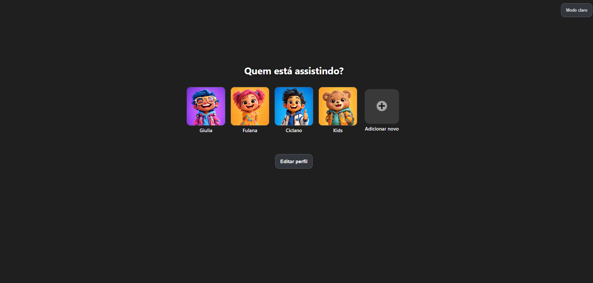
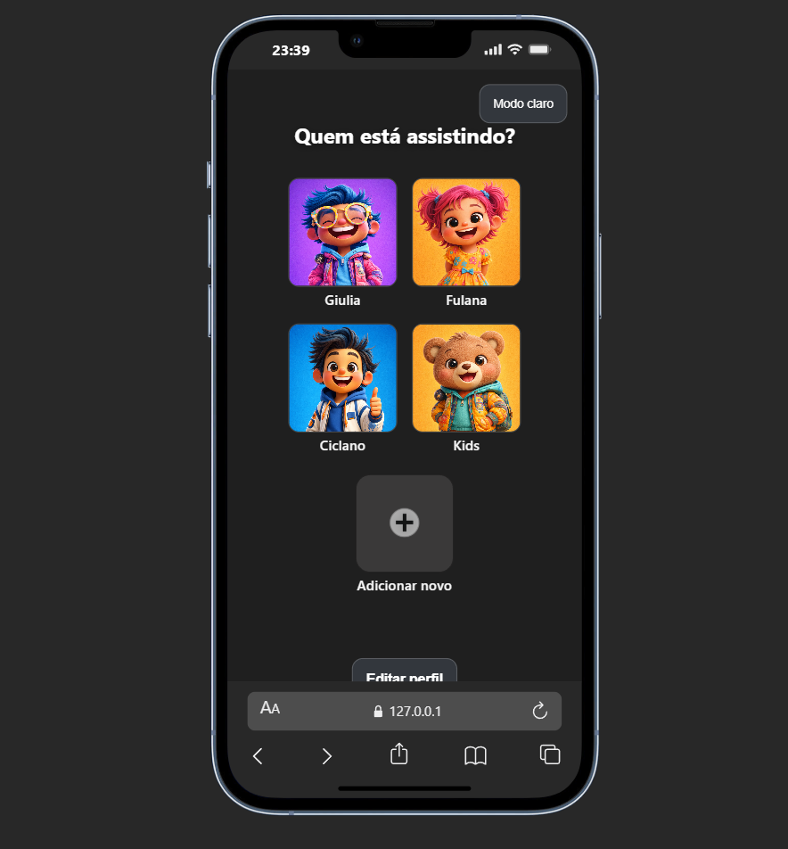
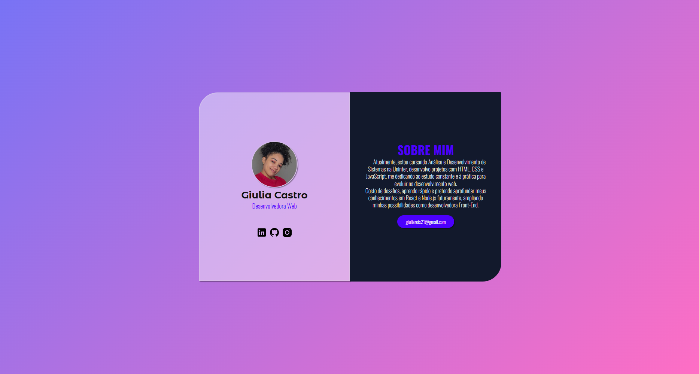
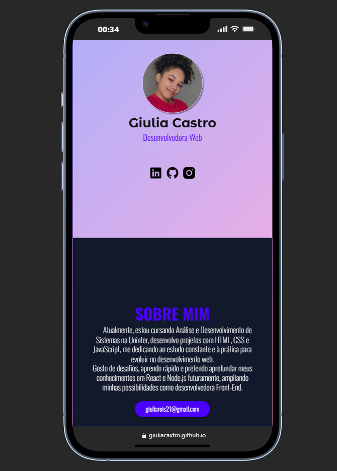

# Giulia Castro dos Reis da Silva
Desenvolvedora Front-End | HTML | CSS | JavaScript | Python

Cidade: Dom Eliseu/PA 68633-000 

Contato: (94)984****23 

Email: giuliareis21@gmail.com 

Linkedin: https://www.linkedin.com/in/giuliacaxtro/ 

GitHub: https://github.com/GiuliaCaxtro 

# Sobre 
Desenvolvedora buscando a primeira oportunidade de estágio.
ConhecimentosDesenvolvimento de projetos **Front-End** utilizando **HTML, CSS e JavaScript**, com prática em estruturação, estilização e interatividade de páginas web. 

- Conhecimento básico em Python. 
- Estudo contínuo de tecnologias modernas e interesse em evolução para React e Node.js, visando atuação Full-Stack. 

## Educação  

Análise e Desenvolvimento de Sistemas Uninter- 2026 Python, HTML, CSS, básico de VScode e Pycharm (IDE)

Inglês para escrita, leitura e conversação (A2) 

# 💻 Meus Projetos de Estudo em HTML e CSS

Este repositório contém alguns projetos que desenvolvi enquanto estudava **HTML, CSS e JavaScript**.
Cada projeto foi feito com foco em aprender conceitos específicos do desenvolvimento web.

---
## 🎬 Projeto Netflix com IA(Perfis)

🔗 Acessar pagina: https://giuliacaxtro.github.io/projeto_netflix/

 Acessar repositorio: https://github.com/GiuliaCaxtro/Meus-projetos/blob/main/projeto-netflix

Este projeto foi desenvolvido durante a **Imersão Front-End na Era da IA da Alura**.

Ele simula a tela de seleção de perfis da Netflix, com foco em **interface moderna, responsividade e interatividade**.

### 🧠 O que foi praticado:

* Estrutura semântica com HTML
* Estilização avançada com CSS (variáveis e responsividade)
* Manipulação do DOM com JavaScript
* Alternância entre **modo claro e escuro**
* Uso de **localStorage** para salvar preferências do usuário
* Boas práticas de organização de código

### ✨ Destaques:

* Interface inspirada em plataforma real
* Efeitos de hover e transições suaves
* Layout responsivo (mobile e desktop)
* Melhorias com apoio de Inteligência Artificial

---

## 👤 Card de Perfil - Giulia Castro

  

Projeto de **card de perfil profissional** desenvolvido com HTML e CSS, focado em design moderno, organização e responsividade.

🔗 Acesse: https://giuliacaxtro.github.io/projeto_card-perfil/

Acesso repositório do projeto: https://github.com/GiuliaCaxtro/card-perfil

### 🚀 Tecnologias

* HTML5
* CSS3
* Google Fonts

### 🎯 Funcionalidades

* Foto, nome e profissão
* Links para redes sociais
* Seção "Sobre mim"
* Botão de contato por e-mail
* Layout moderno com efeito glassmorphism

### 💡 Aprendizados

* Estrutura semântica
* Flexbox
* Responsividade
* Organização de código
* Variáveis CSS

----

## 📱 Projeto Android

  

🔗 **Acessar projeto:**
https://giuliacaxtro.github.io/projeto_android/

Este projeto foi criado do zero com **HTML e CSS**.
O objetivo foi praticar a **estrutura de um site completo**, trabalhando com:

* Estrutura HTML
* Estilização com CSS
* Organização de conteúdo
* Layout de página

---

## Bradesco - GenAI & Dados (Bootcamp Dio) 
Python para analise e organização de dados, usando inteligência artificial generativa, SQL, Excel, Power Query e Microsoft Copilot no dia a dia. Aprenda passo a passo com desafios guiados e atividades mão na massa, e desenvolva uma aplicação que conversa por voz com o ChatGPT usando Whisper (OpenAI) e Python. 

**Em desenvolvimento..**

---

## 📜 Projeto Cordel

🔗 **Acessar projeto:**
https://giuliacaxtro.github.io/projeto_cordel/

Neste projeto eu pratiquei principalmente:

* Posicionamento de imagens de fundo
* Uso de background no CSS
* Efeitos visuais em seções da página
* Estilização de texto estilo cordel

---

## 🚀 Tecnologias utilizadas

* HTML5
* CSS3
* JavaScript

---

📚 Estes projetos fazem parte do meu processo de aprendizado em **desenvolvimento web**.

